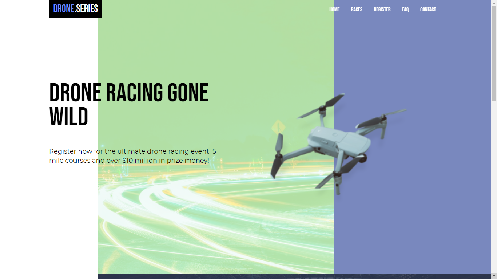

# Drones


## About this project

The idea of the application is:

_"It's a simple page"_

## Why?

This project is part of my personal portfolio, it was developed during a course, powered by Scrimba, that's called From Figma to Code. I'll be happy if you could send me any feedback about the project, code, structure or anything that you can report that could make me better as a developer!

Reach me at: bwesleysouza@gmail.com

Connect with me at [LinkedIn](https://www.linkedin.com/in/).

And you can use this project as you wish!

## Getting started

### Installing

**Cloning the Repository**

```
$ git clone https://github.com/souzawesley/drones.git

$ cd dronesClone
```

### Running

Just open the index.html file and it should work.

## Build with

- Pure HTML, CSS and JavaScript.

## Contribuing

It was developed by me during my From Figma to Code course. I'll be glad to receive any feedback about something that a I need to redo. And if you have any question....

Reach me at: bwesleysouza@gmail.com

_or_

Try it: [LinkedIn](https://www.linkedin.com/in/)

Thank you!

## License

This project is licensed under the MIT License - see the [LICENSE.md](./LICENSE.md) file for details.
